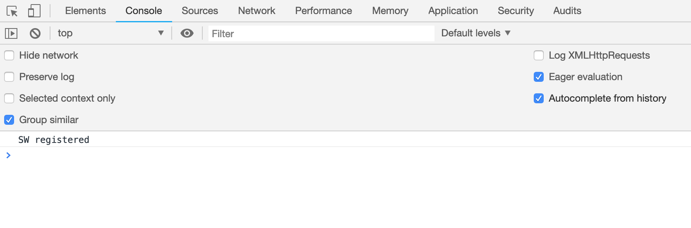

## Réponses

###  Ecrire du code Javascript

1. Le JavaScript peut être insérér de trois manières à notre fichier HTML. Considérons un fichier HTML simple, avec une structure basique, c'est aà dire un head et un body.  
On peut écrire notre code JavaScript:

On utilise le tag \<script> :  
* Dans le **head**
  ``` HTML
   <!DOCTYPE>
   <html>
        <head>
            <script>  
        votre code Javascript
            </script>
   </head>
   <body>

   </body>
   </html>

* Dans le **body**

```HTML
<!DOCTYPE>

<html>
    <head>

    </head>

    <body>
    <script>
        Votre code Javascript
    </script>
    </body>

</html>  

```  
* Editer un fichier portant l'extension .js

Vous avez la possibibilité de créer un fichier JavaScript externe et de l'insérer à votre code HTML. Supposons que nous avons créer un fichier nommé _"test.js"_ et nous devons l'insérer à notre page HTML. il suffit d'ajouter un attribut "src" au tag \<script>, qui va spécifier le chemin relatif de notre code Javascript

``` HTML

<script src = test.js></script>

```
C'est d'ailleurs cette méthode que vous allez utliser le plus pour des raisons de compréhension et de clarté du code. Et je vous conseille d'insérer le fichier JavaScript juste après la balise fermante body.    


2.  Une fois votre code JavaScript écrit il doit être interpreté et éxécuter par un programme appeleé Moteur JavaScript. De nos jours les navigateurs Web embarquent tous des moteurs JavaScript. Ainsi chaque Navigateur est doteéé de la console qui nous permerra d'éxécuter nos futurs programmes JavaScript.

* **Google Chrome**: Google V8
* **Mozilla FireFox**: SpiderMonkey
* **Safari**: JavaScript Core
* **Internet Explorer**: Chakra.  

> **Astuces**:  Pour ouvrir la console dans les navigateurs. Une fois que vous êtes sur n'importe quelle page Web, _faites un clique droit et cliquer sur **Inspecter l'élement**_ et rendez vous dans la console.


### Syntaxe

Dans cette section nous parlerons de l'indentation des commentaires et des varibales.

### Indentation

Indenter son code signifie décaler certaines instructions par rapport à d'autres. Son but principal est de rendre son code plus lisible et plus compréhensible. Son utilisation est très simple il suffit de penser à une sorte arborescence.  
##### **Exemple code indenter**:  

``` html
<html>
    <head>

        <meta>
    </head>

</html>
```

##### **Exemple code non indenter**: 

``` HTML
<html>
<head>
<meta>
</head>
</html>
```

### Commentaires

Les commentaires jouent plusieurs rôles au sein d'un programme:

* Les commentaires permettent au développeur qui l'a écrit de se souvenir de ce que faisait telles ou telles lignes de code
* Les commentaires permettent au développeur d'isoler temporairement une ou plusieurs lign de code. En effet les commentaires ne sont pas interprétés par nle moteur JS, elles sont invisibles pour le navigateur.
* Les commentaires expliquent mieux le code à toute personne qui se trouve pour la première devant le dit programme.
Ainsi en JavaScript nous avons deux types de commentaires:  

Les _**commentaires multilignes**_ et les _**commentaires monolignes**_.

``` Javascript

//Ceci est un commentaire monoligne  

/*Ceci est un commentaire multilignes
qui peut aller sur plusieurs lignes*/

```

### Variables

5. Une variable est un emplacement meémoire qui persmet de stockeé des informations de manière temporaire. Comme son nom l'indique la valeur varie.

6. En Javascript, il existe un seul mot clé pour déclarer une variable(Nous verrons plus tard que cela n'est pas exactement correct). On utilise le mot clé **var**
``` Javascript
var nom;
```
7. Alors comme règle de nomenclature cela est assez simple:
* Une variable commence par une lettre minuscule ou un blanc souligné
* Une variable doit avoir un nom (son identificateur), un type(qui est deéterminé en JavaScript uniquement par la valeur qu'il contient), et une valeur.
* Le  nom d'une variable doit idéalement être simple et précis, ne courrez pas le risque de donnner des noms farfelus. De plus il doit respecter la notation CamelCase. C'est aà dire chaque nouveau mot dans l llongue chiane de caractere de son nom doit commencer par une lettre majuscule.

* Une déclaration peut se faire pour plusieurs variables à la fois. Il suffit de les séparer par une virgule

``` Javascript

var uneVariable = 3 // uneVariable représente son nom et 3 la valeur qu'il contient.

var 7variables// le nom e cette variable est incorrect. 

var uneVariable = 2, autreVariable = 4, encoreUneVariable = 5;

```
8. Le Javascript est un langage très faiblement typé ce qui signifie que vous n'avez pas besoin de spécifier le type d'une variable quand on l'a déclarer, comme pour d'autres Langage.  
Ainsi le JavaScript devines implicitement le type d'une variable grâce à la valeur que vous lui assigné. On distingue donc 5 types principaux en JavaScript

* **Number**: Le type number représente l'ensemble des nombres entiers, et réel positifs ou négatifs que l'on peut utiliser.

```javascript

var number1 = 2;
var number2 = -2;
var number3 = 2.3;
``` 

* **String**: Le type String représente une chaine de caractère ou un caractère, en gros c'est du texte. Pour indiquer qu'une variable est un string lors de l'assignation, il faut entourer le texte, avec les simples ou double guillemets.

``` javascript
var chaine1 = 'miguel';// chaine est de type string

var chaine2 = "miguel"// chaine2 est de type string aussi.

var chaine3 = "5";/* chaine3 est également de type string, en effe meme si vous placez un nombre et qu'il est entre les guillemets, JavaScript le considèrera comme une variable de type String*/
```

* **Boolean**: Le type Boolean est un type particulier. En effet une variable en JavaScript de ce type ne peut stocker que deux valeurs, True ou False. Elles sont géneéralement utilisées pour des tests. Ainsi il faudra pas mettre de guillemet ou d'apostrophes.

```javascript
var a = true; // a stocke un booléen avec la valeur true

var b = "false" ; // b stocke une varibale de type String.
```
9. Pour déclarer une variable en JavaScript on utilise le mot clé **var** suivi du nom de la variable. Lors de la déclaration, on peut assigneé une valeur aà cette variable, comme nous l'avons vu précedemment c'est cette valeur qui permettra de deéfinir son type. Ainsi nous allons prendre quelques exmples, pour vous montrer les différentes façons de déclarer des variables en JavaScript.

```javascript
var nom = 'miguel'; // Ceci est un variable de type String, nous avons initialisé une valeur à la variable nom lors de sa déclaration.

var nom; // Nous avons déclarer la variable nom sans sans l'initialisé.

var nom,prenom,age //Nous avons déclareé plusieurs variables sans initialisation

var nom = 'miguel', prenom = 'yann', age = 12;// nous déclarons et initialisons plusieurs variables en même temps

```

10. En effet ces déclarations sont exactes en JavaScript, je vous ai dit plutôt que le JavaScript est un langage aà typage dynamique, c'est aà dire qu'une variable une fois déclarée peut prendre des valeurs différentes tout au long du programme. En effet

```javascript
var uneVariable = 'miguel' //ici uneVariable stocke une valeur de type String

var uneVariable = 12;// ici uneVariable a stocke maintenant 12 et a écrasé l'ancienne valeur

var uneVariable = true //Vous aurez compris, ici elle stocke une valeur de type boolean.

```

**_Retenez que en JavaScript le typage est faible et une variable peut prendre différentes valeurs_**

11. Caster une variable signifie tout simplement de modifier son type en un autre type, une sorte de conversion.Il exite des fonctions qui vous permettent de le faire. Prenons un exemple plus parlant.

```javascript
var nom = "12";// je rappelle que 12 ici est considéré comme un String

var nom = nom.ParseInt("12",10)// la variable nom a été caster en Number, ici 12 est bien une valeur de type Number.
```
De même nous pouvons caster une variable de type Number en String

```javascript
var nom = 12;//ici 12 est de type Number

var nom = nom.toString();// nom ici va stocker la valeur de type string "12"

```

Attention si vous caster une valeur de type String qui ne peur être caster en Number vous obtiendrez une valeur de type **NaN**, qui signifie tout simplement Not A Number

```javascript
var nom = "miguel"
var nom = parseInt("miguel",10);// ici nom stocke Nan car miguel ne peut pas être caster.
```

Vous pouvez faire de même pour caster pour les float avec la fonction parseFloat().


12. Nous avons vu que les types de bases ou types primitifs de JavaScript sont les Numbers, les Strings et les Boolean. 

* Commençons par les Numbers. Alors les valeurs de type Numbers sont les entiers positifs ou négatifs comme nous avons en mathématiques. Les opérations qui peuvent s'effectuer entre elles sont les opeérations de base en mathématiques à savoir: la multiplication, la division, la soustraction, l'addition et le modulo.

```javascript

var a = 10;
var b = 13;

var somme = a + b // somme contient 23
var division = a / b // division contient 1.3
var multiplication = a*b // multiplication contient 130
var modulo = b%a; // modulo contient 3
var difference = a-b;// difference contient -3
```

* Ensuite les Strings: On parle ici d'opérations sur les valeurs de type String. Seul l'opérateur **+** peut être utilisé pour les valeurs de ce type, on parle alors de concaténation. Vous trouverez des exemples ci-dessous

```javascript

 var x = "miguel";
 var y = "yann";
 var z = x + y; //// z contient "miguelyann"
 


 ```

 * Concernant les Boolean: Ce type de variable est spéciale car il existe uniquement des opérateurs dits "logiques" qui s'effectuent sur les valeurs de type boolen(en l'occurence **true** et **false**)
 Il s'agit des opérateurs suivants: **&&**, **||**, et  **!**  

 **&&** représente le ET Logique  
 **||** représente le OU logique
 **!** représente le NON logique

 je vous invité à consulter cette [page](https://fr.wikipedia.org/wiki/Alg%C3%A8bre_de_Boole_(logique)) pour plus vous documenter sur l'algèbre de Boole, pour mieux comprendre de quoi il s'agit.

 ```javascript
 var a = true;
 var b = false;

 var c = a&&b; // c stocke ici false
 var d = a||b; // d stocke ici true
 var e = !a; // e stocke ici false
 ```

 13. Cette phrase signifie d'afficher un message dans la console d'un navigateur Web. En effet **console** est un objet fourni par le langage Javascript(On en viendra plus tard), et **log** est une méthode de l'objet **console**. Et les arguments que vous passerez à cette méthode seront affichés à dans la console de votre navigateur(comme nous l'avons vu à la question numéro 2)



14. Nous allons procédez questions par question en commençant biensur par la variable n1.
```javascript
/* n1 stocke '24'. En effet il s'agit ici de la concaténation de deux chaines de caractères*/  

    var n1 = a1 + a2;  

/*n2 stocke '24', car lorsque vous additionnez une variable de type String avec un nombre, le type String   
*prend la priorité et javaScript considère que vous faites allusion à deux variables de type String*/

    var n2 = a1 + b1;

/* n3 stocke 8. Ici le javascript sait que l'on ne peut pas multiplier deux variables de type String,  
* ainsi il utilise une sorte d'inférence pour deviner que vous voulez multiplier de variable de type Number*/

    var n3 = a1 * a2;  

    /*n4 stocke 8 par le même principe, mais je tiens à préciser que c'est parce que l'opérateur peut s'effectuer entre les deux opérandes, une valeur de type String ne peut se multiplier par une valeur de type Number*/
    var n4 = a1 * b1;

    /*n5 stocke '2hello'. Il s'agit ici de la concaténation de deux valeurs de type String*/
    var n5 = a1 + c1;

    /*n6 stocke NaN. En effet comme je vous l'ai précisé pour l'exemple passé(celui de n4).
    Deux variables de type String ne peuvent pas effectuer une opération * sauf si ce sont des valeurs numériques que vous déclarés en tant que String. */
    var n6 = a1 * c2;

    /*n7 stocke "helloallo". Il s'agit de la concaténation de deux variables de type String.*/
    var n7 = c1 + c2;

    /*n8 stocke "hello4. En effet lorsque vous additionnez une valeur de type String avec une valeur de type Number,  
     l'inférence du JavaScript considère que la valeur qui vient derrière la valeur de type String est un String aussi.*/
    var n8 = c1 + b2;

    /*n9 stocke "24hello". Par le même principe*/
    var n9 = a1 + b1 + c1;

    /*n10 stocke "2442helloallo". */
    var n10 = a1 + a2 + b1 + b2 + c1 + c2

    /*n11 stocke "14helloallo*/
    var n11 = a1 * a2 + b1 + b2 + c1 + c2

    /*n12 stocke "624helloallo"*/
    var n12 = b1 + b2 + a1 + a2 + c1 + c2

```

15. Rappellons rapidement ce que sont les tables de vérité de ET, et de OU.

**TABLE VERITE ET**    

1  **ET** 0  => 0  
1  **ET** 1  => 1  
0  **ET** 1  => 0  
0  **ET** 0  => 0


**TABLE VERITE ET**    

1  **OU** 0  => 1  
1  **OU** 1  => 1  
0  **OU** 1  => 1  
0  **OU** 0  => 0

Alors en programmation nous parlons en termes de variables de type boolean, ici 0 correspond à la valeur false et 1 à la valeur true. Vous avez donc manipulé les opérateurs avec les variables de ce type.

```javascript
/*Le nom de variable de reflete pas la vraie vie ceci est juste pour un exemple de code 😆*/
var verite = true;
var mensonge = false;

/*Le programme affichera toutes les valeurs de notre table de vérite*/

/*ET*/
console.log(verite && mensonge);// false
console.log(verite && verite); // true
console.log(mensonge && verite); // false
console.log(mensonge && mensonge) // false

/*OU*/

console.log(verite || mensonge); // true
console.log(verite || verite); // true
console.log(mensonge || verite); // true
console.log(mensonge || mensonge); // false


```

16. 
```javascript
var nomPrenom = "Miguel Yann";

var positionPrenom = nomPrenom.indexOf("Yann")
console.log(positionPrenom); // 7

var nbreCaractereNomPrenom = nomPrenom.length();
console.log(nbreCaractereNomPrenom); // 11

var votreNom = nomPrenom.replace("Miguel Yann", "\"votre nom\""); // il affichera "votre nom";

